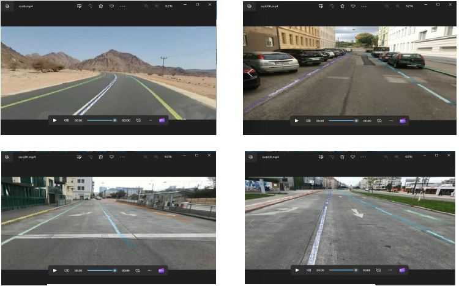
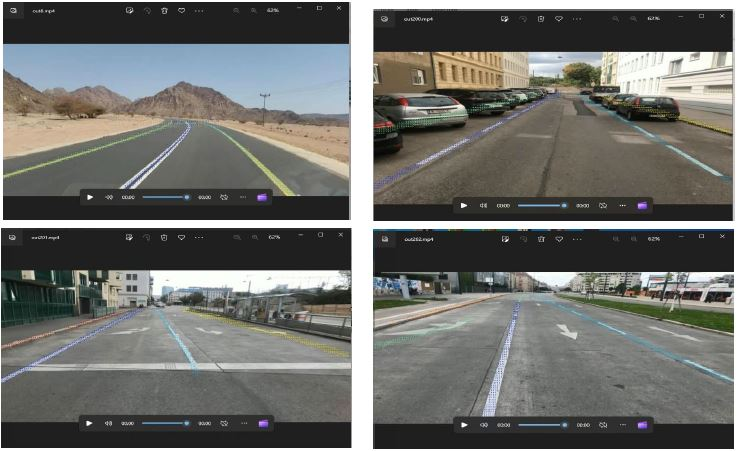

# LaneAF: Robust Multi-Lane Detection with Affinity Fields

You can download paper using https://paperswithcode.com/paper/laneaf-robust-multi-lane-detection-with


- Outputs(DLA-34):



################################################

- Outputs(Erfnet):




## Overview
1) [Installation](#installation)
2) [TuSimple](#tusimple)
3) [Pre-trained Weights](#pre-trained-weights)
4) [Citation](#citation)

## Installation
1) Clone this repository
2) Install Anaconda
3) Create a virtual environment and install all dependencies:
```shell
conda create -n laneaf pip python=3.6
source activate laneaf
pip install numpy scipy matplotlib pillow scikit-learn
pip install opencv-python
pip install https://download.pytorch.org/whl/cu101/torch-1.7.0%2Bcu101-cp36-cp36m-linux_x86_64.whl
pip install https://download.pytorch.org/whl/cu101/torchvision-0.8.1%2Bcu101-cp36-cp36m-linux_x86_64.whl
source deactivate
```
You can alternately find your desired torch/torchvision wheel from [here](https://download.pytorch.org/whl/torch_stable.html).

4) Clone and make DCNv2:
```shell
cd models/dla
git clone https://github.com/lbin/DCNv2.git
cd DCNv2
./make.sh
```

## TuSimple
The entire [TuSimple dataset](https://github.com/TuSimple/tusimple-benchmark/issues/3) should be downloaded and organized as follows:
```plain
└── TuSimple/
    ├── clips/
    |   └── .
    |   └── .
    ├── label_data_0313.json
    ├── label_data_0531.json
    ├── label_data_0601.json
    ├── test_tasks_0627.json
    ├── test_baseline.json
    └── test_label.json
```
The model requires ground truth segmentation labels during training. You can generate these for the entire dataset as follows:
```shell
source activate laneaf # activate virtual environment
python datasets/tusimple.py --dataset-dir=/path/to/TuSimple/
source deactivate # exit virtual environment
```

### Training
LaneAF models can be trained on the TuSimple dataset as follows:
```shell
source activate laneaf # activate virtual environment
python train_tusimple.py --dataset-dir=/path/to/TuSimple/ --backbone=dla34 --random-transforms
source deactivate # exit virtual environment
```
Other supported backbones are `erfnet` and `enet`.

Config files, logs, results and snapshots from running the above scripts will be stored in the `LaneAF/experiments/tusimple` folder by default.

### Inference
Trained LaneAF models can be run on the TuSimple test set as follows:
```shell
source activate laneaf # activate virtual environment
python infer_tusimple.py --dataset-dir=./path/to/TuSimple/ --split=manual --manual-path=./manual-path/  --snapshot=./path/to/trained/model/name of trained model.pth --save-viz

For example for me:
python infer_tusimple.py --dataset-dir=./data/tusimple --split=manual --manual-path=./test/data  --snapshot=./experiments/tusimple/2022-08-14-08_28/net_0003.pth --save-viz

source deactivate # exit virtual environment
```
This will generate outputs in the TuSimple format and also produce benchmark metrics using their [official implementation](https://github.com/TuSimple/tusimple-benchmark/tree/master/doc/lane_detection).


## Pre-trained Weights 

You can download my pre-trained model weights using: https://drive.google.com/drive/folders/1qGhOgt4PUqGrAq28ytxSZnMa0fPWZQnS

## Citation
If you find our code and/or models useful in your research, please consider citing the following papers:

    @article{abualsaud2021laneaf,
    title={LaneAF: Robust Multi-Lane Detection with Affinity Fields},
    author={Abualsaud, Hala and Liu, Sean and Lu, David and Situ, Kenny and Rangesh, Akshay and Trivedi, Mohan M},
    journal={arXiv preprint arXiv:2103.12040},
    year={2021}
    }
   
   You can find writer github using: https://github.com/sel118/LaneAF
   
   ## Owner Github linke 

You can find writer github using: https://github.com/sel118/LaneAF

